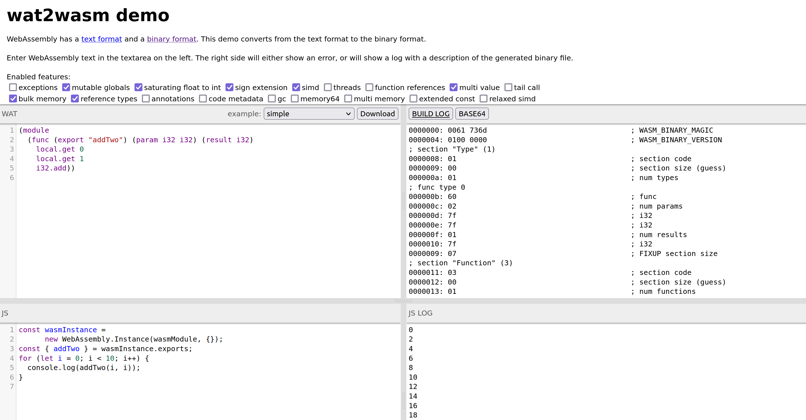

# 09 -  WebAssembly

Web Assembly (WASM) est un format binaire d’instructions pour une machine à pile infinie. Comme tout autre format de langage d’assemblage, WASM est du code généré par un compilateur. Son plus grand avantage est qu’il peut être exécuté dans le navigateur, en utilisant JavaScript. Il y a déjà beaucoup de langages de programmation qui peuvent être compilés ayant WASM comme code cible (target).

On arrive, donc, au moment qu’on peut écrire des programmes dans des langages de programmation complèxes, comme Rust, C ou même Kotlin et, ensuite, les exécuter dans le navigateur en tant que code compilé dans WASM.

Dès nos jours, beaucoup d’autres langages de programmation ont introduit la possibilité d’exécution des modules de WASM.

:::info
Le succès de WASM est assez similaire au succès de Java au moment de son apparition. Java a attiré l’attention des programmeurs toujours grace à son portabilité. Rappellez-vous que le code en Java est compilé en tant que bytecode. On pouvait donc écrire des applets en Java et les exécuter dans le navigateur en utilisant la machine virtuelle de Java (JVM). On a commencé à utiliser WASM de la même manière, mais à un niveau plus avancé.
:::

## WAT vs WASM

Comme on a déjà dit, WASM est un format binaire. C’est-à-dire, pour écrire directement du WASM, il faut écrire seulement des nombres, ce qui est vraiment dificile à faire et on peut faire des erreurs assez facilement. Si on veut une manière plus proche des langage d’assamblage usuels, on peut utiliser le format WAT (Web Assembly Text). 

Ce format contient des mots clés qu’on peut lire et comprendre. Ensuite, il faut transformer ce fichier du format WAT en format WASM en utilisant un outil spécial (par exemple, [wat2wasm](https://github.com/WebAssembly/wabt)). On obtient toujours un fichier binaire WASM mais, cette fois-ci, il ne s’agit pas du code dans un langage de programmation qu’on a compilé, mais directement du web assembly sous la forme texte.

Ouvrez ce [site](https://webassembly.github.io/wabt/demo/wat2wasm/). Vous obtiendriez la page suivante:



Dans la partie gauche on voit le code écrite dans la forme WAT et, à la droite, dans WASM. Observez les différences. Ne vous concentrez pas sur ce qu’il fait pour ce moment. Observez seulement qu’on peut identifier et comprendre les instructions pour le format WAT. 

## Structure et instructions

### Modules
Le code en WebAssembly est organisé dans des modules. Un module contient un ensemble d’instructions, définitions et appels des fonctions. Pendant notre travail avec WASM, on utilisera un seul module. La déclaration d’un module se fait de la manière suivante:

```wasm
(module)
```

### Types
Pour ce TP, on va utiliser les types numériques:

| Type | Description | 
| - | - |
| `i32` | nombre entier sur 32 bits | 
| `i64` | nombre entier sur 64 bits |
| `f32` | nombre avec virgule flotante sur 32 bits | 
| `f64` | nombre avec virgule flotante sur 64 bits |  

### Variables
Pour les variables, comme dans les programmes usuelles, on peut les déclarer et ensuite accéder à et changer leur valeur. 

```wasm
(module
  (func $main
    (local $var i32) ;; create a local variable named $var
    (local.set $var (i32.const 10)) ;; set $var to 10
    local.get $var ;; load $var onto the stack
  )
  (start $main)
)
```

### Ajouter des valeurs à la pile
On a déjà vu, dans l’exemple précédent, comment ajouter des variables sur la pile, en utilisant `local.get $<nom_de_la_variable>`

Pour les valeurs, l’instruction pour l’ajout a la forme suivante: 
```wasm
<nom_du_type>.const <valeur>

//Exemple
(module
  (func $main
    ;; load `10` and `3` onto the stack
    i32.const 10
    i32.const 3
  )
  (start $main)
)
```

Vous trouverez toutes les instructions avec des variables [ici](https://developer.mozilla.org/en-US/docs/WebAssembly/Reference/Variables).

### Opérations arithmétiques
On peut aussi faire des opérations arithmétiques avec les variables. Sachant que WASM fonctionne sur le modèle de machine avec une pile (donc, sans régistres), il faut mettre les opérandes sur la pile et ensuite appeller l’opération. 

```wasm
(module
  (func $main
    ;; load `10` and `3` onto the stack
    i32.const 10
    i32.const 3

    i32.add ;; add up both numbers
  )
  (start $main)
)
```

Vous trouverez toutes les opérations possibles sur les nombres entières [ici](https://developer.mozilla.org/en-US/docs/WebAssembly/Reference/Numeric).

### Contrôle du flux
L’instruction `if` prend la première valeur de la pile. Si elle est `1`, on exécute les instructions associées. On peut ajouter aussi l’instruction `else`, les instructions duquel sont exécutées si la valeur est `0`.

```wasm
(module
  (func
    i32.const 0 ;; change to positive number (true) if you want to run the if block
    (if
      (then
        ;;instructions pour le cas vrai
      )
      (else
        ;;instructions pour le cas faux
      )
    )
  )
  (start 1) ;; run the first function automatically
)
```

Pour les boucles, on utilise deux instructions: `block` et `loop`, chacune ayant une instruction `end` et une instruction `br` associées. La différence entre les deux est la suivante: `br` à l’intérieur d’un `loop` saute vers le commencement du `loop` et `br` à l’intérieur d’un `block` saute vers la fin du `block`.

```wasm
i32.const 1
local.set $i
block $endfor
  loop $for
    local.get $i
    i32.const 120
    i32.gt
    br_if $endfor
    local.get $i
    call $print 
    local.get $i
    i32.const 1
    i32.add
    local.set $i
    br $for
  end $for
end $endfor
```

Vous pouvez voir toutes les instructions de contrôle du flux [ici](https://developer.mozilla.org/en-US/docs/WebAssembly/Reference/Control_flow).

### Fonctions

La définition d’une fonction a la syntaxe suivante:
```wasm
( func <signature> <variables_locales> <corps> )

;;Exemple: fonction qui prend un seul paramètre p et renvoie deux fois sa valeur en faisant la somme entre p et lui-même.
(func (param $p i32)
  (result i32)
  local.get $p
  local.get $p
  i32.add)
```

## Importer des fonctions

Une fonctionnalité importante des modules WASM est leur capacité d’importer et exporter des fonctions. C’est-à-dire, dans notre module WASM, on peut utiliser des fonctions extèrnes, qu’on ne pourrait pas avoir autrement (par exemple, écrire vers la console de `JavaScript` en utilisant `console.log()`).

```wasm
(module
  ;; import the browser console object, you'll need to pass this in from JavaScript
  (import "console" "log" (func $log (param i32)))

  (func
    i32.const 0 ;; change to positive number (true) if you want to run the if block
    (if
      (then
        i32.const 1
        call $log ;; should log '1'
      )
      (else
        i32.const 0
        call $log ;; should log '0'
      )
    )
  )

  (start 1) ;; run the first function automatically
)
```
Dans cet exemple, observez l’instruction `import`, qui importe la fonction `$log`. Cette fonction prend comme paramètre un nombre entier sur 32 bits.

## Exercices

:::info
Pour les exercices d’aujourd’hui, on utilisera [was](https://github.com/alexandruradovici/was), un outil déjà preparé pour vous, qui importe beaucoup de fonctions que vous pouvez utiliser.
:::

0. Lisez le `README` du projet [was](https://github.com/alexandruradovici/was). Regardez comment l’utiliser (les sections `Assemble` et `Run`) et quelles sont les fonctions que vous pouvez intégrer dans vos programmes (la section `Libraries`).
1. Ecrivez dans le fichier `ex1.wat` un programme qui calcule de l'expression `5-4*2/(1+3)`.
2. Ecrivez dans le fichier `ex2.wat` un programme qui initialise 3 variables locales avec les valeurs 4, 5 et 6 dans la fonction `start` et calcule le résultat de l'expréssion `a+b%c`.
3. Écrivez dans le fichier `ex3.wat` un programme qui lit une chaîne de caractères du clavier et affiche son longueur. Importez et utilisez les fonctions `readstr` et `writeint`.
4. Écrivez dans le fichier `ex4.wat` un programme qui affiche votre nom vers la sortie. Utilisez la fonction `writestr`. Vous pouvez aussi regarder un exemple [ici](https://github.com/alexandruradovici/was/blob/master/example/write_string.wat).
5. Ecrivez dans le fichier `ex5.wat` un programme qui affiche sur l'écran le cube de chaque nombre de l'intervalle `[1, 10]`.
6. Ecrivez dans le fichier `ex6.wat` une fonction qui vérifie si un nombre reçu comme paramètre est premier et affichez un message. Appelez cette fonction dans la fonction `start`.